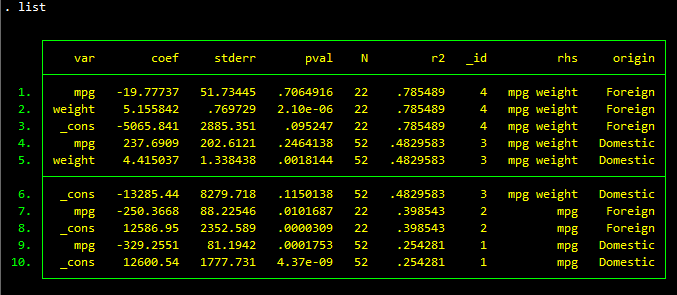
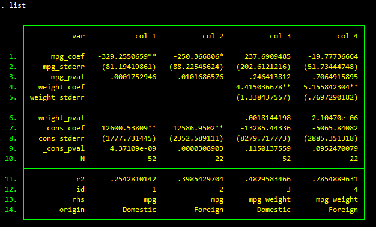

# REGSAVE: extract and store regression results

- Current regsave version: `1.4.9 4mar2021`

- Current regsave_tbl version: `1.2 09mar2023`

- Jump to:  [`overview`](#overview) [`installation`](#installation) [`tutorial`](#tutorial) [`updates`](#update-history) [`author`](#author)

-----------

## Overview

`regsave` is a [Stata](http://www.stata.com) command that fetches estimation results from `e()` and stores them in "wide" format (default) or "table" format:

- By default, results are stored in wide format. Use this format when you want to further analyze your regression results using Stata.

- If you specify the `table()` option, results are stored in table format.  You can then outsheet those results to a text file, or use [texsave](https://github.com/reifjulian/texsave) to output your table in LaTeX format (see example below). Use the `table()` option when you want to create a publication-quality table.

The helper command `regsave_tbl` converts the dataset in memory from wide format to table format.

For more details, see the Stata help file included in this package.

## Installation

```stata
* Determine which version of -regsave- you have installed
which regsave
which regsave_tbl

* Install the most recent version of -regsave-
net install regsave, from("https://raw.githubusercontent.com/reifjulian/regsave/master") replace
```

## Tutorial

First, make sure you have the most recent version of `regsave` installed on your computer:
```stata
net install regsave, from("https://raw.githubusercontent.com/reifjulian/regsave/master") replace
```

The example code below opens one of Stata's built-in datasets and then regresses automobile price on miles per gallon and/or weight. The code estimates these regressions for two different types of automobiles: domestic cars and foreign cars. The code uses `regsave` to save the results of each regression to a tempfile and then displays the contents of that file.

```stata
* Example #1
tempfile results
sysuse auto, clear

local replace replace
foreach rhs in "mpg" "mpg weight" {
	foreach type in "Domestic" "Foreign" {
	
		reg price `rhs' if foreign=="`type'":origin, robust
		regsave using "`results'", pval autoid `replace' addlabel(rhs,"`rhs'",origin,"`type'") 
		local replace append
	}
}

use "`results'", clear
list
```

The contents of the dataset, as displayed by `list`, look like this:


We could also have saved t-statistics or confidence intervals by specifying the appropriate options. (Type `help regsave` at the Stata prompt to see the full set of options.)

The `table()` option saves results in a "wide" format that is more appropriate for creating tables. The following code runs the same regressions as above, but saves the output in table format.

```stata
* Example #2
tempfile results_tbl
sysuse auto, clear

local num = 1
local replace replace
foreach rhs in "mpg" "mpg weight" {
	foreach type in "Domestic" "Foreign" {
	
		reg price `rhs' if foreign=="`type'":origin, robust
		regsave using "`results_tbl'", pval autoid `replace' addlabel(rhs,"`rhs'",origin,"`type'") table(col_`num', asterisk(5 1) parentheses(stderr))
		local replace append
		local num = `num'+1
	}
}

use "`results_tbl'", clear
list
```

This resulting output looks like this:



It is often convenient to first save a set of regressions to a file using `regsave` and then later convert those results to a table using the `regsave_tbl` helper command:

```stata
* Example #3

* Load the saved results from Example #1 above
use "`results'", clear
tempfile my_table

* Convert those results to table format
local run_no = 1
local replace replace
foreach orig in "Domestic" "Foreign" {
	foreach rhs in "mpg" "mpg weight" {
		
		regsave_tbl using "`my_table'" if origin=="`orig'" & rhs=="`rhs'", name(col`run_no') asterisk(5 1) parentheses(stderr) `replace'
		local run_no = `run_no'+1
		local replace append
	}
}

* The resulting table is identical to what was produced in Example #2 above
use "`my_table'", clear
list
```

See [texsave](https://github.com/reifjulian/texsave) to learn how to save this table in LaTeX format.

## Update History

* **March 9, 2023**
  - Fixed minor `sigfig()` bug that formatted some non-numbers as numbers
    
* **October 25, 2019**
  - Added `rtable` option
  
* **January 30, 2019**
  - N now stored as double/long for large datasets

* **January 26, 2019**
  - Added `sigfig()` option

* **December 31, 2018**
  - Added the help file `regsave_tbl.hlp` to installation package
  - Added error catching code to `regsave_tbl.ado`


## Author

[Julian Reif](http://www.julianreif.com)
<br>University of Illinois
<br>jreif@illinois.edu
